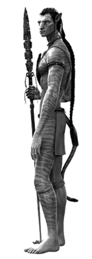

---
tags:
  - 2024-tv1
  - wmdm-h7
  - wmdm-k3
layout: exercise
---
# Opgave 2
_2 pt_ - 2024 tijdvak 1.

## Inleiding
In de sciencefictionfilm *Avatar* ontmoeten mensen een inheemse bevolking van een andere planeet, de Na’vi: lange, blauwe, intelligente mensachtige wezens met een staart die in harmonie met de natuur leven. 

De mens Jake Sully krijgt de opdracht om contact te leggen met de Na’vi. Zijn hersenen en lichaam worden daartoe via speciale apparatuur draadloos verbonden met een Na’vi-lichaam, zijn ‘avatar’, dat speciaal voor dit doel is gekweekt (zie afbeelding hieronder). 

Jake krijgt prikkels toegediend in zijn menselijke lichaam dat in een speciale machine in een laboratorium ligt. En ook zijn Na’vi-lichaam wordt zintuiglijk geprikkeld in de omgeving van de Na’vi waarin hij zich voortbeweegt.

In het begin beweegt Jake nog moeizaam en klungelig met zijn Na’vilichaam, maar al rennend, springend en zwemmend leert hij steeds beter zijn balans te houden. Met het verschil tussen de klungelige verhouding die Jake in het begin heeft tot zijn Na’vi-lichaam en de beheerste verhouding die hij er later toe heeft, kan worden uitgelegd wat Andy Clarks begrippen ‘interface’ en ‘cyborg’ inhouden.

## Vraag

Leg uit welk van deze twee begrippen past bij de verhouding die Jake in het **begin** tot zijn Na’vi-lichaam heeft. 

Leg vervolgens uit welk van deze twee begrippen past bij de verhouding die Jake **later** tot zijn Na’vi-lichaam heeft.