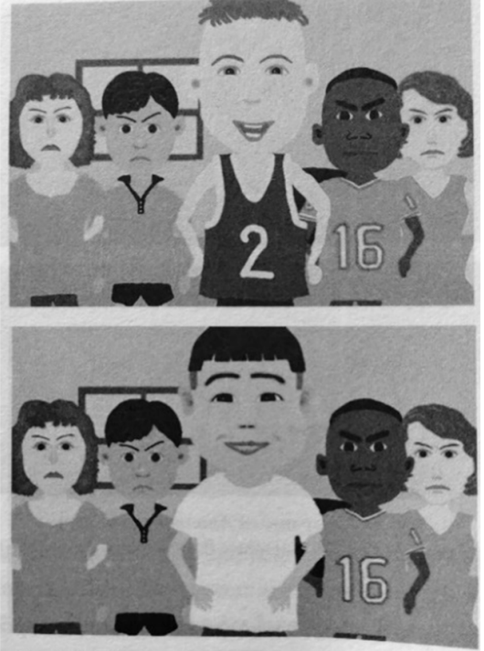

---
tags:
  - 2026-tv1
  - wmdm-k2
  - wmdm-h6
  - et-12
layout: exercise
---

# Opgave 18
_1 pt_ - 2026 tijdvak 1.

## Inleiding

Vijftig jaar geleden deed psycholoog Paul Ekman onderzoek naar de universaliteit van emoties. Net als veel andere wetenschappers van dat moment dacht Ekman dat mensen wereldwijd dezelfde basisemoties hebben, zoals boosheid, verdriet en vreugde, en dat deze door alle mensen worden geuit met dezelfde gelaatsuitdrukkingen. 

De psycholoog Batja Mesquita was vroeger sterk beïnvloed door Ekman, maar ontdekte later belangrijke verschillen tussen culturen op het gebied van emoties. In haar boek *De emoties tussen ons* beschrijft ze hoe Amerikaanse proefpersonen de middelste personen op de afbeelding (hieronder) zien als blij. Japanse proefpersonen nemen de hele situatie in ogenschouw en noemen de middelste personen niet blij. Mesquita maakt een onderscheid tussen twee modellen van emoties. Het MINE-model van emoties is volgens haar dominant in westerse landen: emoties zijn ‘van mij’. Emoties zoals trots of blijdschap worden daarbij begrepen als mentaal (M), binnen in het individu (IN) en altijd met dezelfde eigenschappen (E).

In vrijwel alle niet-westerse landen is volgens Mesquita het OURS-model dominant: emoties zijn ‘van ons’. Volgens dit model bestaan emoties buiten de persoon (OUT), relationeel (R) en situationeel (S). Zo is blijdschap volgens Japanners geen innerlijke emotie van één individu, maar bestaat dit in het gedrag tussen mensen. 

Er bestaan uiteenlopende visies op wat emoties zijn, voortkomend uit verschillende visies op het menselijke denken en voelen. 

Vanuit de 4E-theorie van belichaamd denken (*embodied cognition*) zouden aanhangers een opvatting kunnen vormen over wat emotie is. Deze zou kunnen aansluiten bij het MINE-model van emoties.

## Vraag

Leg uit in welk opzicht een opvatting over emoties vanuit de stroming belichaamd denken zou kunnen aansluiten bij het MINE-model.
